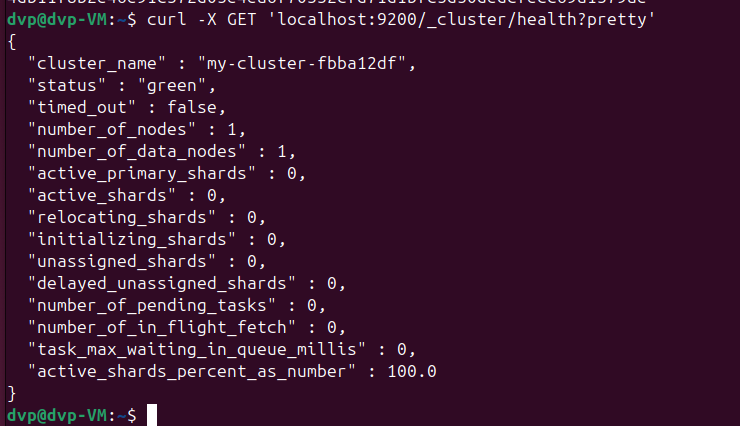
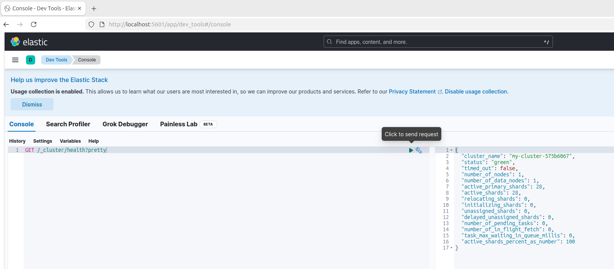
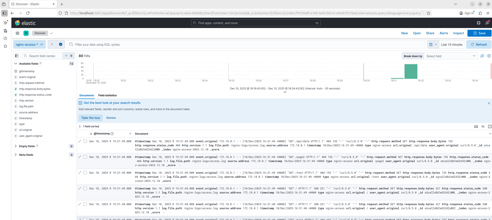

# Домашнее задание к занятию "`ELK`" - `Прокутин ДВ`


---

### Задание 1 Elasticsearch
Установите и запустите Elasticsearch, после чего поменяйте параметр cluster_name на случайный.

Приведите скриншот команды 'curl -X GET 'localhost:9200/_cluster/health?pretty', сделанной на сервере с установленным Elasticsearch. Где будет виден нестандартный cluster_name.


```
RANDOM_CLUSTER_NAME="my-cluster-$(date +%s%N | md5sum | head -c 8)"

docker run -d --name elasticsearch \
  -p 9200:9200 \
  -p 9300:9300 \
  -e "discovery.type=single-node" \
  -e "cluster.name=${RANDOM_CLUSTER_NAME}" \
  -e "xpack.security.enabled=false" \
  docker.elastic.co/elasticsearch/elasticsearch:8.11.0

  curl -X GET 'localhost:9200/_cluster/health?pretty'
```




---

### Задание 2 Kibana
Установите и запустите Kibana.

Приведите скриншот интерфейса Kibana на странице http://<ip вашего сервера>:5601/app/dev_tools#/console, где будет выполнен запрос GET /_cluster/health?pretty.

```
docker run -d --name kibana \
  -p 5601:5601 \
  -e "ELASTICSEARCH_HOSTS=http://elasticsearch:9200" \
  --link elasticsearch:elasticsearch \
  docker.elastic.co/kibana/kibana:8.11.0
```




---

### Задание 3 Logstash
Установите и запустите Logstash и Nginx. С помощью Logstash отправьте access-лог Nginx в Elasticsearch.

Приведите скриншот интерфейса Kibana, на котором видны логи Nginx.

```
/task3/docker-compose.yml
```



### Задание 4

`Приведите ответ в свободной форме........`

1. `Заполните здесь этапы выполнения, если требуется ....`
2. `Заполните здесь этапы выполнения, если требуется ....`
3. `Заполните здесь этапы выполнения, если требуется ....`
4. `Заполните здесь этапы выполнения, если требуется ....`
5. `Заполните здесь этапы выполнения, если требуется ....`
6. 

```
Поле для вставки кода...
....
....
....
....
```

`При необходимости прикрепитe сюда скриншоты
`
